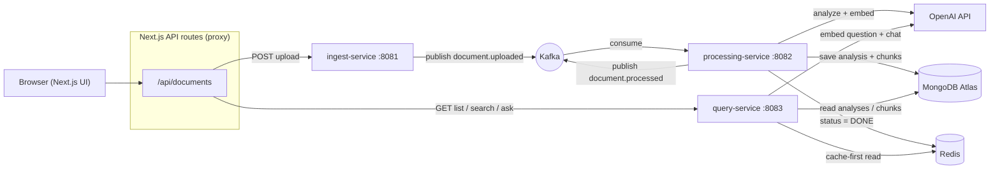

# Signalyze Stream

> An event-driven, AI-powered document-intelligence platform. Upload a contract or agreement and get back a structured breakdown — parties, key terms, and risk-flagged clauses — then ask the document questions in plain English.

Built as a hands-on system-design project: a small fleet of Spring Boot microservices communicating asynchronously over Apache Kafka, with MongoDB for persistence, Redis for caching and status, OpenAI for analysis and retrieval-augmented Q&A, and a TypeScript Next.js frontend.

---

## Screenshots

<!-- Drop your screenshots into docs/images/ and they'll render here. -->

| Analysis | Ask the document |
|----------|------------------|
|  |  |

---

## What it does

- **Structured analysis** — every upload is classified (Service Agreement, NDA, Invoice, …) and broken into parties, key terms, and severity-rated risk flags, not just a paragraph summary.
- **PDF and text support** — PDFs are parsed server-side with Apache PDFBox before analysis; plain text works too.
- **Ask the document (RAG)** — ask a natural-language question and get an answer grounded in the document, with the source excerpts it was drawn from. Real retrieval-augmented generation: chunk → embed → retrieve by similarity → generate.
- **Manage & find** — search the archive by filename or document type, and delete documents you no longer need.

---

## Architecture

The pipeline is asynchronous end to end. The upload returns immediately; analysis happens in the background and the UI polls for status.



Three Kafka topics carry the flow: `document.uploaded`, `document.processed`, and `document.failed` (the dead-letter topic for messages that fail processing after retries). See [docs/architecture.md](docs/architecture.md) for the full write-up and the datastore rationale.

### How the RAG Q&A works

1. **Index (at processing time):** the document text is split into overlapping ~800-character chunks; each chunk is embedded with OpenAI `text-embedding-3-small` and stored in MongoDB alongside the analysis.
2. **Ask (at query time):** the question is embedded, scored against every chunk of that document by cosine similarity, and the top matches become the context for a `gpt-4o-mini` completion that is instructed to answer only from those excerpts.

Retrieval is scoped to a single document's handful of vectors, so in-app cosine similarity is the right tool — no vector database required. (MongoDB Atlas Vector Search would be the upgrade path at scale.)

---

## Tech stack

| Layer | Technology |
|-------|------------|
| Services | Java 21, Spring Boot 3.4 |
| Messaging | Apache Kafka (KRaft mode) |
| Persistence | MongoDB Atlas (Spring Data MongoDB) |
| Cache / status / rate limiting | Redis |
| AI | OpenAI `gpt-4o-mini` (analysis + answers), `text-embedding-3-small` (retrieval) |
| PDF parsing | Apache PDFBox |
| Frontend | Next.js (App Router), TypeScript, plain CSS design tokens |
| Local orchestration | Docker Compose |
| Planned | Jenkins (CI/CD), Terraform + AWS (deploy) |

---

## Services

| Service | Port | Responsibility |
|---------|------|----------------|
| ingest-service | 8081 | Accept uploads, extract text (PDFBox), rate-limit, publish `document.uploaded` |
| processing-service | 8082 (internal) | Consume events, run AI analysis, chunk + embed for RAG, persist to MongoDB/Redis |
| query-service | 8083 | Cache-first reads, search, delete, and the `/ask` RAG endpoint |
| web | 3000 | Next.js UI + API-route proxy to the services |

---

## Run it locally

**Prerequisites:** Docker Desktop, Node 20+, a MongoDB Atlas connection string, and an OpenAI API key.

1. **Configure secrets.** Copy the example env file and fill in your keys:

   ```bash
   cp .env.example .env
   # edit .env: set MONGODB_URI and OPENAI_API_KEY
   ```

2. **Start the backend** (Kafka, Redis, and the three services):

   ```bash
   docker compose up --build -d
   ```

3. **Start the frontend:**

   ```bash
   cd web
   cp .env.local.example .env.local   # if present; otherwise create it (see below)
   npm install
   npm run dev
   ```

   `web/.env.local` points the UI at the services:

   ```
   INGEST_URL=http://localhost:8081
   QUERY_URL=http://localhost:8083
   ```

4. Open **http://localhost:3000**, upload a document, and try asking it a question.

Kafka UI is available at http://localhost:8080 for inspecting topics.

---

## Project structure

```
signalyze-stream/
├── services/
│   ├── ingest-service/       # upload → text extraction → Kafka
│   ├── processing-service/   # Kafka consumer → AI analysis + RAG indexing
│   └── query-service/        # reads, search, delete, /ask (RAG)
├── web/                      # Next.js + TypeScript frontend
├── docs/                     # architecture notes + ADRs
├── infra/                    # Terraform (planned)
└── docker-compose.yml
```

---

## Roadmap

Built in phases:

- [x] Async core — Kafka event pipeline with dead-letter handling
- [x] Data layer — MongoDB persistence + Redis cache/status/rate-limiting
- [x] AI analysis — structured, risk-flagged document breakdown
- [x] Frontend — Next.js UI with polling and a clean design system
- [x] Document intelligence — PDF support, search, delete, and RAG Q&A
- [ ] CI/CD — Jenkins pipeline
- [ ] Cloud — Terraform + AWS deployment

---

## License

MIT — see [LICENSE](LICENSE).
