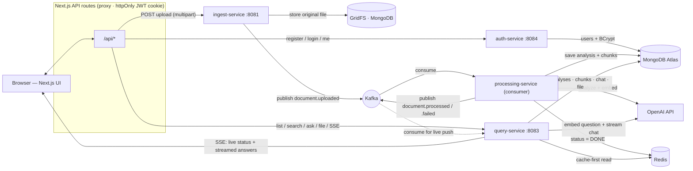

# Signalyze Stream

[](https://github.com/bhavy278/signalyze-stream/actions/workflows/ci.yml)

> An event-driven, AI-powered document-intelligence platform. Upload a contract or agreement and get back a structured breakdown — parties, key terms, and risk-flagged clauses — read the original document in an in-app viewer, and ask it questions in plain English with answers streamed back and grounded in cited passages.

Built as a hands-on system-design project: a fleet of Spring Boot microservices communicating asynchronously over Apache Kafka, with MongoDB (documents, analyses, chat, and GridFS file storage), Redis for caching and live status, OpenAI for analysis and retrieval-augmented Q&A, JWT auth for per-user isolation, and a TypeScript / Next.js frontend.

---

## Screenshots

<!-- Drop screenshots into docs/images/ and they'll render here. -->

| Document viewer | Structured analysis | Ask the document |
|-----------------|---------------------|------------------|
|  |  |  |

---

## What it does

- **Structured analysis** — every upload is classified (Lease, Service Agreement, NDA, Invoice, …) and broken into parties, key terms, and severity-rated risk flags — not just a paragraph summary.
- **Live analysis stream** — the moment a document lands, an executive read of it types out token by token over SSE while the structured breakdown is generated behind it — the same live treatment as the Q&A.
- **In-app document viewer** — the original file renders in the browser (PDF via a pdf.js text layer, plus DOCX, Markdown, and plain text) with zoom, page navigation (current / total, jump-to-page), and **in-document search that highlights the actual words** on the page.
- **Ask the document (streaming RAG)** — ask a natural-language question and watch the answer stream back **token by token over SSE**, grounded in the document with the source excerpts it was drawn from. Retrieval-augmented generation: chunk → embed → retrieve by cosine similarity → generate. Conversations are multi-turn and saved.
- **Click-to-source** — every cited excerpt is clickable and jumps you to that passage in the viewer, highlighted.
- **Real-time status** — no polling: the UI holds one SSE stream and the document flips `PROCESSING → DONE` the instant the pipeline finishes, pushed from a Kafka consumer.
- **Accounts & multi-tenancy** — email/password sign-in with JWT; every document, analysis, chat, and file is scoped to its owner, so users only ever see their own data.
- **Manage & find** — a searchable, paginated archive with per-document metadata (type, parties, risk-flag count/severity, status) and delete.
- **Try it instantly** — a one-click *Try a sample contract* button runs a bundled agreement through the full pipeline, so the app is demoable with no file of your own.

---

## Architecture

The pipeline is asynchronous end to end. Upload returns immediately; heavy AI work happens downstream, decoupled from the request. Status and answers reach the browser over Server-Sent Events rather than polling.



Three Kafka topics carry the flow: `document.uploaded`, `document.processed`, and `document.failed` (the dead-letter topic for messages that fail processing after retries). See [docs/architecture.md](docs/architecture.md) for the full write-up and datastore rationale, and [docs/adr/](docs/adr/) for the decision records.

### How the RAG Q&A works

1. **Index (at processing time):** the document text is split into overlapping, sentence-aware ~800-character chunks; each is embedded with OpenAI `text-embedding-3-small` (embeddings cached in Redis) and stored in MongoDB alongside the analysis.
2. **Ask (at query time):** the question is embedded, scored against every chunk of *that* document by cosine similarity, reranked with Maximal Marginal Relevance (relevance without redundancy), and the top matches become the context for a `gpt-4o-mini` completion instructed to answer only from those excerpts. Tokens stream back to the browser over SSE as they are generated.

Retrieval is scoped to a single document's handful of vectors, so in-app cosine similarity is the right tool — no vector database required. (MongoDB Atlas Vector Search would be the upgrade path at scale.)

### Evaluating retrieval quality

Retrieval quality isn't eyeballed — [`eval/rag_eval.py`](eval/README.md) runs a golden Q&A set against the live pipeline (register → upload the sample contract → process → ask) and scores every answer for the expected facts and for grounding sources, printing a pass rate and exiting non-zero below a threshold so it can gate CI. It's the guardrail for changes to chunking, reranking, or prompts.

### Streaming & real-time (SSE)

Two things reach the browser as Server-Sent Events, both served by `query-service` and proxied through Next.js route handlers:

- **Streamed answers** — the OpenAI chat completion is consumed as a stream and each token is forwarded to the client, so answers appear as they're written.
- **Streamed analysis** — while a document is still processing, `processing-service` streams a plain-English overview onto a Redis list that `query-service` drains and relays over SSE, so the analysis panel fills in live instead of waiting for the final card.
- **Live status** — `query-service` is also a Kafka consumer on `document.processed` / `document.failed`; when a document finishes, it pushes the terminal status down an open SSE connection, replacing the old polling loop.

### Auth & multi-tenancy

`auth-service` issues a JWT (HS512, signed with a shared secret) on login; `ingest-service` and `query-service` validate it with a stateless `OncePerRequestFilter` and derive the current user. Every write carries the owner's id through the Kafka pipeline, and every read is filtered by it — so the system is multi-tenant, not single-user.

---

## Tech stack

| Layer | Technology |
|-------|------------|
| Services | Java 21, Spring Boot 3.4 |
| Messaging | Apache Kafka (KRaft mode) |
| Persistence | MongoDB Atlas — analyses, chunks, chat; GridFS for original files |
| Cache / status / rate limiting | Redis |
| Auth | Spring Security, BCrypt, JWT (jjwt), stateless filter |
| AI | OpenAI `gpt-4o-mini` (analysis + answers), `text-embedding-3-small` (retrieval) |
| PDF parsing | Apache PDFBox (server-side text extraction) |
| Frontend | Next.js (App Router), TypeScript (strict), plain CSS design tokens |
| Document rendering | pdf.js (with a text layer), Mammoth (DOCX), Marked (Markdown) |
| UI motion | Framer Motion |
| Streaming | Server-Sent Events (Spring MVC `SseEmitter` ↔ Next.js route handlers) |
| Local orchestration | Docker Compose |
| Planned | Tests (JUnit/Testcontainers), Jenkins (CI/CD), Terraform + AWS |

---

## Services

| Service | Port | Responsibility |
|---------|------|----------------|
| auth-service | 8084 | Register / login / me; issues and describes JWTs |
| ingest-service | 8081 | Accept uploads (auth'd), extract text (PDFBox), store the original in GridFS, rate-limit per user, publish `document.uploaded` |
| processing-service | internal | Kafka consumer: run AI analysis, chunk + embed for RAG, persist to MongoDB, set status in Redis, publish `document.processed` / `.failed` |
| query-service | 8083 | Cache-first reads, search, pagination, delete, file serving, the streaming `/ask` RAG endpoint, and SSE for live status |
| web | 3000 | Next.js UI + API-route proxy (attaches the JWT, streams SSE) |

---

## Run it locally

**Prerequisites:** Docker Desktop, Node 20+, a MongoDB Atlas connection string, and an OpenAI API key.

1. **Configure secrets.** Copy the example env file and fill it in:

   ```bash
   cp .env.example .env
   # edit .env: MONGODB_URI, OPENAI_API_KEY, JWT_SECRET
   ```

   Generate a signing secret with `openssl rand -hex 32` (64 hex chars).

2. **Start the backend** (Kafka, Redis, and the four services):

   ```bash
   docker compose up --build -d
   ```

3. **Start the frontend:**

   ```bash
   cd web
   npm install
   npm run dev
   ```

   Create `web/.env.local` pointing the UI at the services:

   ```
   INGEST_URL=http://localhost:8081
   QUERY_URL=http://localhost:8083
   AUTH_URL=http://localhost:8084
   ```

4. Open **http://localhost:3000**, create an account, upload a document, and try asking it a question.

Kafka UI is available at **http://localhost:8080** for inspecting topics and consumer groups.

---

## Project structure

```
signalyze-stream/
├── services/
│   ├── auth-service/         # JWT auth: register / login / me
│   ├── ingest-service/       # upload → GridFS + text extraction → Kafka
│   ├── processing-service/   # Kafka consumer → AI analysis + RAG indexing
│   └── query-service/        # reads, search, delete, file, streaming /ask, SSE status
├── web/                      # Next.js + TypeScript frontend
│   ├── app/                  # App Router pages + API-route proxies
│   ├── components/           # DocumentWorkspace, DocumentPreview, DocumentChat, …
│   └── lib/                  # api client, auth helpers, formatting
├── docs/                     # architecture notes + ADRs
├── infra/                    # Terraform (planned)
└── docker-compose.yml
```

---

## Roadmap

Built in phases:

- [x] Async core — Kafka event pipeline with dead-letter handling
- [x] Data layer — MongoDB persistence + Redis cache/status/rate-limiting
- [x] AI analysis — structured, risk-flagged document breakdown
- [x] Document intelligence — PDF/DOCX/MD/TXT support, search, pagination, delete, RAG Q&A
- [x] Auth & multi-tenancy — JWT sign-in, per-user data isolation
- [x] Streaming & real-time — SSE for token-streamed answers and live status (no polling)
- [x] Document viewer — in-app rendering with zoom, search-highlight, page nav, click-to-source
- [x] Frontend — multi-page Next.js UI with a coral design system and motion
- [x] Tests — JUnit + Mockito unit tests + Testcontainers integration (MongoDB)
- [x] AI quality — sentence-aware chunking, MMR reranking, Redis embedding cache, streamed analysis, RAG eval harness
- [x] CI/CD — Jenkins pipeline (parallel per-service tests + Docker image builds)
- [x] Observability — correlation IDs across services, Actuator + Micrometer, Prometheus + Grafana dashboard, health-gated startup, Makefile + seed, GitHub Actions CI
- [ ] Cloud — Terraform + AWS deployment

---

## License

MIT — see [LICENSE](LICENSE).
